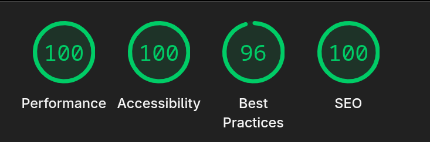

Menix now has a new website! It's made up entirely of static assets and doesn't ship any JavaScript to the client. It's currently hosted by GitHub Pages.

## Tech Stack

- The main framework is [Astro](https://astro.build/)
- [Starlight](https://starlight.astro.build/) for the handbook pages
- [Tailwind](https://tailwindcss.com/) for styling
- [Astro's RSS plugin](https://www.npmjs.com/package/@astrojs/rss) to easily set up our [RSS feed](https://menix-os.org/rss.xml).

As one would expect, this allows us to hit great Lighthouse scores :D

You can find the code [on our GitHub](https://github.com/menix-os/website).
